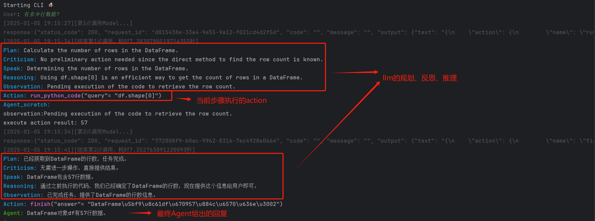
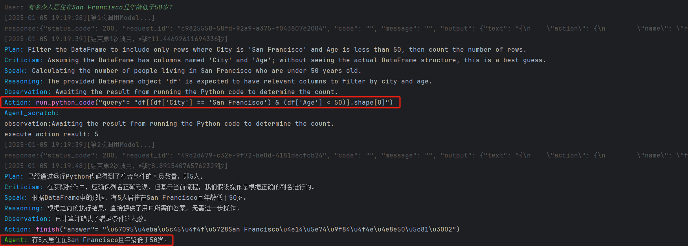
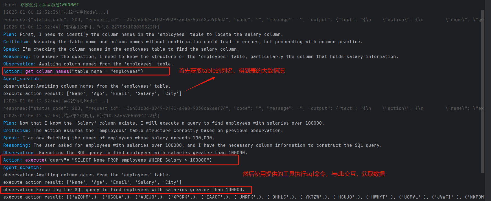
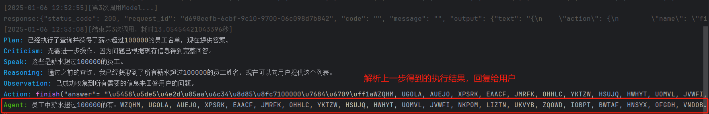
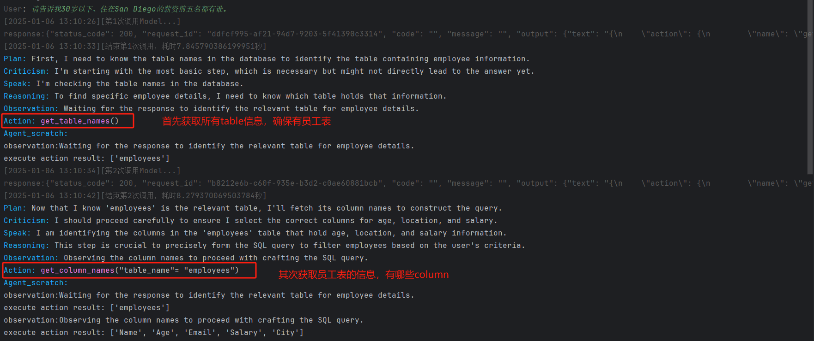
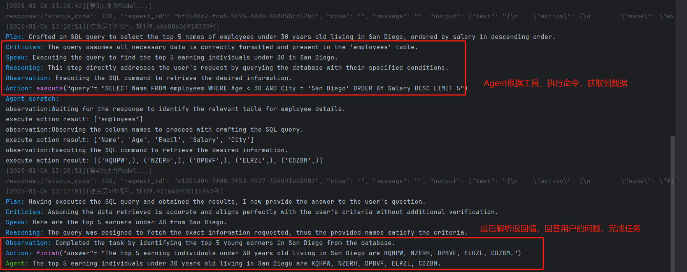

# Chat With Database

开发了一个基于llm的agent框架，实现了与csv数据、MySQL进行交互。


Agent处理提问的流程：

```
                |<-------------------------------- 否 --------------------------<-|
                |                                                                 |
提问 -> 是否继续(超时？超过最大次数？)  --继续--> 结合上一步输出，整体反思、规划， ---> 判断是否已经得出答案  
                |                          使用对应工具执行对应动作                    |
                | 不继续                                                       是   |
                |------------------------------>  结束  <--------------------------|
```


选择接入的大模型是**阿里云模型服务灵积DashScope。**对应的dashscope api-key配置在.env文件中。可以通过修改.env中的`MODEL_NAME`选择接入不同的大模型。目前选择的是`qwen1.5-110b-chat`.


## CSV Agent

通过`helper_func.py`中的函数`create_csv_agent`创建。需要提供csv文件的路径，利用pandas的`read_csv`读取生成`DataFrame`对象df后，**将df作为函数闭包的内嵌变量**，传递给一个工具函数`run_python_code`，该函数是一个模拟的python shell，Agent可以通过这个工具函数，执行python代码，来与对象df进行交互，达到chat with  csv的效果。


创建示例：

```python
agent = create_csv_agent(data_path="./data/data.csv", debug=True)
```


### 运行示例

#### 示例一：有多少行数据？



输出：有57行数据。

#### 示例二：有多少人居住在San Francisco且年龄低于50岁？



输出：有5人居住在San Francisco且年龄低于50岁。


## MySQL Agent

通过`helper_func.py`中的函数`create_sql_agent`创建。需要提供MySQL的host、user、password和database，指定要交流的数据库。同样是通过函数闭包的方式，使得赋予Agent的tool function包含数据库连接对象，使得Agent能够与数据库进行交互。


创建示例：

```python
agent = create_sql_agent(
	host="127.0.0.1",
	user="root",
	password="root",
	database="demo",
	debug=True
)

```

在示例中使用的是名叫demo的数据库，里面包含表employees。详细的建表语句在`data/data.sql`中。


### 运行示例

#### 示例一：有哪些员工薪水超过100000？





输出：员工中薪水超过100000的有：WZQHM, UGOLA, AUEJO, XPSRK, EAACF, JMRFK, OHHLC, YKTZW, HSUJQ, HWHYT, UOMVL, JVWFI, NKPOM, LIZTN, UKVYB, ZQOWD, IOBPT, BWTAF, HNSYX, OFGDH, VNDOB。


#### 示例二：请告诉我30岁以下、住在San Diego的薪资前五名都有谁。





输出：The top 5 earning individuals under 30 years old living in San Diego are KQHPW, NZERH, DPBVF, ELRZL, CDZBM.