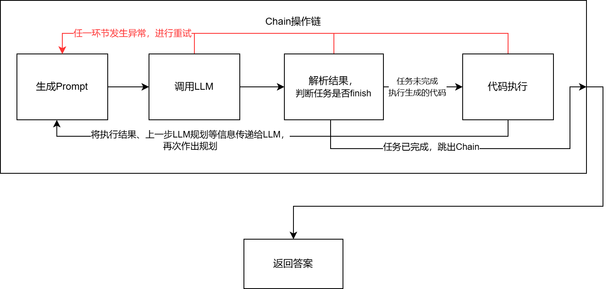

# Chat With Database

开发了一个基于llm的agent框架，实现 CSV Agent，以pandas作为数据处理工具，实现了与csv数据进行交互。


## 运行示例

#### chat with csv file


#### chat with dataframes


#### use tools


## 1. 为什么要做一个“Chat With Database”？它解决的核心问题是什么？

**“Chat with Database” 弥合自然语言与结构化数据之间的鸿沟，解决传统数据库交互中效率、门槛和灵活性的关键痛点。以下是其核心解决的问题及意义：**

1. **数据访问门槛高**
   - **问题**：传统 SQL 编写依赖技术背景，非技术人员（如业务、产品人员）无法直接获取数据。
   - **解决**：通过自然语言交互，用户无需学习 SQL 语法即可查询数据库，降低数据操作门槛。
2. **复杂查询效率低**
   - **问题**：即使是技术人员，面对多表关联、嵌套查询时也需要反复调试 SQL，耗时耗力。
   - **解决**：自动生成优化后的查询逻辑，减少手动编码错误，提升数据探索效率。
3. **数据洞察延迟**
   - **问题**：从提出问题到获得结果需经历“需求沟通-SQL开发-结果解释”的长链路，无法快速支持决策。
   - **解决**：实时交互式对话直接输出结果与可视化分析，缩短数据到决策的路径。
4. **动态需求适配难**
   - **问题**：固定报表无法满足突发性、多变的业务问题（如临时分析用户行为趋势）。
   - **解决**：通过对话灵活调整查询逻辑，支持即时、动态的数据探索。

”Chat with database“使得用户可以通过对话的方式向系统提出问题，使用户能够更轻松地获取所需信息，而不必直接进行复杂的数据库查询操作。这是"Chat with database"的核心价值所在。


## 2. “Chat With Database”的技术难点是什么？现有相关工作/工具有哪些？他们分别是怎么实现的？

做"Chat with database"实际上就是实现一个 LLM-based 的智能体 Agent。我们需要 LLM 的能力来理解自然语言、阅读用户提问、并给出回答。但是简单使用 LLM 又是不够的。很多场景需要 LLM 与现实世界进行连接才能完成，纯粹的聊天机器人并不能完成我们的任务。比如用户的需求是订购，用户想要执行订购这一操作。如果直接输入给 LLM，得到的回复只会是一大堆无意义的订购操作流程、规则。因此需要赋予给 LLM “手脚”，即执行任务、访问工具的能力。

Agent 是指能够感知环境、做出决策和采取行动的实体，本质上是提示词工程，通过prompt去驱动 LLM 进行规划、思考并调用。而“Chat with database”则是需要赋予 Agent 操作数据的能力。一个好的 Agent 可以根据实际问题去进行计划，并结合用户的反馈逐步优化、给出更好的方案，最后得到答案。

我结合两个现有的开源项目 LangChain 与 PandasAI 来讨论实现 Database Agent 的技术难点。


#### 1.自然语言到结构化查询的转换

##### 技术难点

1. **语义歧义**
   自然语言中的模糊表达（如“最近”、“高销售额”）需要准确映射到数据库字段和逻辑。
2. **复杂查询生成**
   涉及多表连接（JOIN）、聚合函数（SUM/AVG）、嵌套查询时，需生成语法正确的 SQL 或 Pandas 操作。

##### 解决方案

- **LangChain 的 SQL 链（SQLChain）**
  通过预定义提示模板（Prompt Template）约束用户输入格式，结合 Few-Shot Learning 提供示例，引导模型生成正确语法。
- **PandasAI 的语义解析**
  在 PandasAI 中，利用 LLM 对自然语言进行理解、转换，并借助 Pandas 的相关文档，将自然语言映射为 Pandas 操作（如 `df.groupby().agg()`），利用 Pandas 的内置方法来对数据进行准确处理。


#### 2.数据库Schema的复杂性

##### 技术难点

1. **多表关联**
   用户提问可能隐含跨表查询，需自动识别表间关系（如外键）。
2. **动态 Schema 变化**
   数据库结构变化时，需实时同步元数据。

##### 解决方案

- **LangChain的SQLDatabase**
  LangChain 的 `SQLDatabase` 提供 `get_table_info()` 获取相关数据表的元信息，便于LLM理解数据的结构，并快速找出用户问题与相关表、相关字段。

- **PandasAI的模板prompt**
  PandasAI 生成prompt时，利用模板引擎 jinja2，将待数据每个 DataFrame 的 shape 以及示例信息放入到prompt中，有助于LLM理解数据库 Schema：

  ```
  <dataframe>
  dfs[0]:5x3
  EmployeeID,Name,Department
  
  2,Olivia,Finance
  
  1,William,HR
  
  3,John,Sales
  
  </dataframe>
  <dataframe>
  dfs[1]:5x2
  EmployeeID,Salary
  
  5,6000
  
  1,5500
  
  2,5000
  
  </dataframe>
  ```

  


#### 3. LLM与database的交互流程。LLM如何执行相关操作、获取结果、并判断任务的完成与否？

##### PandasAI 的交互框架

PandasAI 有一套独特的 Pipeline 框架：使用 Pipeline 的概念来组织一系列操作：核心是一系列逻辑单元 steps ，每一个step负责一个功能，顺序执行，上一个 step 的输出作为下一个 step 的输入。

比如一个`code_generation_pipeline`包含以下 steps ：验证输入、查找缓存、prompt 生成、代码生成、缓存更新、代码清除。一个`code_execution_pipeline`包含：代码执行、结果验证、结果解析三个步骤。

**pandasai与LLM交互的基本流程如下：**


###### 代码生成阶段

当一个 query 到来，Agent 会将其封装成通用的`ChatPipelineInput`输入到 pipeline。随后，验证输入合法后，以聊天历史信息、Agent 的 DataFrames 的列名的哈希作为 key，去查找缓存。若缓存中存在先前生成过的代码，直接复用；否则，根据模板生成 prompt 输入给 LLM。

生成 prompt 这一步，PandasAI 对已有的信息做了非常详细的阐述，融入到了 prompt 中，确保 LLM 能够给出更加精确、正确率更高的答案。包含在 prompt 中的信息有：

- 待操作的数据 DataFrames 的 shape、以及前 3 列数据。便于 LLM 理解数据。

- 提供给 LLM 可供调用的 skills（实际上是 function）的简介。

- 若上下文信息中包含了上一次生成的代码，反馈给 LLM；否则提供一个非常详细的代码模板，LLM 只需要往模板里填充代码即可。

- 对返回答案 result 的详细描述、约束。明确指出 result 的类型，以及给出示例：

  ```jinja2
  type (possible values "string", "number", "dataframe", "plot"). Examples: { "type": "string", "value": f"The highest salary is {highest_salary}." } or { "type": "number", "value": 125 } or { "type": "dataframe", "value": pd.DataFrame({...}) } or { "type": "plot", "value": "temp_chart.png" }
  ```

有了这些非常详细、明确的约束，使得LLM待执行的任务变得非常清晰，个人认为这是 PandasAI 回答效果的关键。

生成了 prompt 后，Pipeline 将其输入给 Agent 生成时配备的 LLM，将 LLM 生成的代码给更新到缓存，随后输入到代码执行 Pipeline 中。


###### 代码执行阶段

PandasAI 依赖于 Pandas 对数据进行操作，因此需要一个本地的 Python Shell 来执行 LLM 生成的代码（其中涉及的安全问题稍后再谈）。执行前，需要对代码进行一系列预处理：提取出代码涉及的 DataFrames、将原数据 DataFrames 替换到代码中相关对原数据的引用、将用到的 skills，数据放入到环境变量中便于执行等。

执行后，验证结果是否满足要求。最后根据可自定义的 parser 对结果进行解析、返回，并将执行结果更新到 Memory 中。

此外，PandasAI 还配备了自定义的重试机制，可以通过自定义judge函数判断请求是否完成。若判断为未完成，可以重复尝试 N 次。还有 `ErrorCorrectionPipeline`允许在出错时重新生成prompt、代码，提高了 Agent 的鲁棒性。


##### LangChain的交互框架

LangChain 内置了不同的 Agent 类型，每个AgentType 对应一个Agent class，对应一个prompt，决定了该 Agent 的认知框架（再次体现“Agent本质是提示词工程”这一点）。部分 AgentType 如下：

1. Zero-shot ReAct

   核心特点：

   - 无需示例学习：直接根据工具描述和用户输入生成动作，不依赖历史交互示例。

   - 基于 ReAct 框架：交替执行推理（Reasoning）和行动（Action）。

   - 轻量级快速响应：适合简单任务。

2. Structured Input ReAct

   核心特点：

   - 结构化输入支持：要求用户输入或工具返回结果符合预定义结构（如 JSON Schema）。

   - 强类型校验：确保数据格式正确，降低错误率。

   - 适合复杂工具调用：如需要多参数传递的 API。

3. Self-ask with Search

   核心特点：

   - 自问自答模式，递归将大问题分解为小问题，逐步解决子问题。

   - 依赖搜索工具，主要用于需要外部知识补充的场景。

   - 显式中间答案，每个子问题的答案会被记录。

LangChain 的 Agent 执行流程如下图。关键类是`AgentExecutor`，包含一个可运行的agent、一个可使用工具列表`Sequence[BaseTool]`(与swarm类似). AgentExecutor包含许多参数和功能，核心思想还是一个循环：


AgentExecutor 负责调用 Agent，获取反馈、待执行的行动 Action 以及 Action Input，随后根据 LLM 的规划，将 Action Input 传递给下一步调用的工具，获取工具的输出后传递给 Agent，由 LLM 结合工具的输出，进一步作出下一轮的规划，直到满足停止的条件：超时、超过最大尝试轮次或 LLM 判定得到答案，结束本次流程，返回给用户。


#### 3. 若执行发生错误，如何处理？

##### PandasAI 的 retry 机制

在 PandasAI 中，每个基本步骤`BaseLogicUnit`都可以选择在创建时传入一个`on_retry`函数，对应一条`code_exec_error_pipeline`.当执行代码环节发生异常时，会调用错误纠正的逻辑：

```python
while retry_count <= self.context.config.max_retries:
	try:
    	# 执行代码
    except Exception as e:
        # 记录日志
        retry_count += 1
        code = self.on_retry(code, e) # 执行重试
```

但这实际上是待完善功能，目前放在了基本步骤`BaseLogicUnit`的逻辑中，实际上错误处理放在`Pipeline`的主要执行逻辑会更合理。


##### LangChain 的 handle_parsing_errors

在 AgentExecutor 中，存在这一成员变量`handle_parsing_errors`用于决定如何处理 Agent 处理过程中抛出的错误。

- 当该变量设置为`False`，将直接抛出异常，由用户手动处理。

- 当该变量设置为`True`，抛出的异常将作为 Agent 的 observation 发送回LLM，则字符串本身将作为观察值发送给LLM。
- 若该变量是可调用的函数，则将以异常作为参数来调用该函数，并将返回结果传递给 Agent 作为 observation。


## 4. 我的实现

本项目实现的是csv agent，也就是赋予 Agent 与 csv 文件交互的能力。在实现时我选用了 Pandas 这一强大的数据处理库来进行数据分析、处理：Pandas 库功能丰富，其核心数据结构 DataFrame 天然与 csv 文件数据格式契合。因此本项目支持 Chat with csv/dataframes. 

下图是 LLM Agent 的组成图。本质上 LLM Agent 就等于 大语言模型+记忆+规划+工具使用。


#### 交互流程



我觉得代码实现上的核心挑战之一是如何优雅地实现一个可控的循环机制。这个循环机制不仅需要能够自动化地执行任务，还要能够在执行过程中根据任务执行结果进行自我调整和优化。通过这种方式，LLM 能够模仿人类解决问题的基本方法论，如 计划-执行-检查-行动，从而更有效地拆解和解决问题。

在我的实现中，采用 PandasAI 与 LangChain 类似的思想，**将基本步骤串成一条 Chain，Agent 按照 Chain 上定义的步骤进行相应环节。**基础的环节有四个：**Prompt 生成、调用 LLM、解析结果、代码执行**。

在 PandasAI 中，一般的 Pipeline 都是单方向的，在没有配备 judge 函数的情况下，Pipeline 上的每个步骤只会被执行一次，除非创建 Agent 时指定了 judge 函数来判断代码是否符合预期，符合预期就结束循环，执行代码。

```python
"""
PandasAI 的 generate_chat_pipeline.py 的 run 方法
"""
if self.judge:
    # 生成代码code

    retry_count = 0
    while retry_count < self.context.config.max_retries:
    	# judge 函数判断代码是否符合预期，是则结束循环
        if self.judge.evaluate(query=input.query, code=code):
    		break
    	# 重新生成代码
    	retry_count += 1

    output = self.code_execution_pipeline.run(code)
```

不同于 PandasAI ，我的执行链 Chain 具备随时的异常重试，且 Chain 上的操作会循环多次执行，令 LLM 有多轮次的自我反省、思考、规划的机会，不断润色答案。虽然会多耗费 LLM 的 token、耗时较久，但是相比一轮次的 Chain 操作，答案会更加可靠。

当问题到来：

1. 根据预先的 prompt 模板生成 prompt，随后输入到下一步。
2. 调用 LLM。LLM 目前选用的是**阿里云模型服务灵积DashScope。**对应的dashscope api-key配置在.env文件中。可以通过修改.env中的`MODEL_NAME`选择接入不同的大模型。目前选择的是`qwen1.5-110b-chat`。后续可以通过实现抽象类 Model 来兼容更多种类的大模型。
3. 解析 LLM 返回的结果，得到相关规划、反思、行动，以及生成的代码。若 LLM 判定已得出答案，结束流程；否则将生成的代码输入到下一步。
4. 执行 LLM 生成的代码。需要对代码进行预处理，规范格式，通过虚拟终端执行，调用工具、得到结果。

```python
"""
我的实现 chain.py
"""
def run(self, input: Any = None) -> Any:
    """
    执行整条链路的逻辑，遍历每个step，执行其逻辑。输出进行统一的封装，便于数据传递.
    为了确保llm回答的稳定性，尝试n次调用。
    """
    max_request_time = self._context.config.max_request_time
    cur_request_time = 0

    cur_round_input = input
    # 执行n次Chain
    while cur_request_time < max_request_time:
        cur_request_time += 1
        try:
            for i, step in enumerate(self._steps):
                # ...
                # 执行逻辑
                output = step.exec(
                    cur_round_input,
                    context=self._context,
                    logger=self._logger,
                )
				# 执行失败，产生异常
                if not output.success:
                    # 重置输入为初始输入，重新运行
                    cur_round_input = input
                    break

                if output.finish:
                    # 任务完成，返回输出
                    return output.content

                # 更新input
                cur_round_input = output.content

            # 如果这一轮Chain所有操作执行成功，更新聊天记录
            self._update_chat_history()

        except Exception as e:
            # 异常处理
```


#### Planning

Planning 是 Agent 最核心、也是最重要的部分，Agent 需要把任务**划分为子任务**，并规划执行任务的流程；同时要求 Agent 要对任务执行的过程进行**思考与反思**，从而决定是否继续执行，或判断任务完结。

在实现上，我使用了**思维链(CoT)**[[2201.11903\] Chain-of-Thought Prompting Elicits Reasoning in Large Language Models](https://arxiv.org/abs/2201.11903)：一种通过**显式生成中间推理步骤**来提升 LLM 复杂问题解决能力的技术， 来提高 LLM 结果的准确性和可解释性。本质是分步推理技术，引导模型逐步推导出最终答案。其有三个关键特点：

- 显式过程：展示从问题到答案的完整逻辑链（如“因为A，所以B，进而得出C”）。
- 可干预性：允许人工验证或修正中间步骤（如发现第二步错误可直接调整）。
- 泛化能力：适用于数学推理、逻辑判断、因果分析等多种任务。

思维链的实现方式有两种：

1. Few-shot CoT: 首次提出于上述文献，通过在 LLM 的提示 prompt 中添加少量样例来引导模型在生成回答之前首先进行思维链推理。
2. Zero-shot CoT: 由Kojima 等人在文章[[2205.11916\] Large Language Models are Zero-Shot Reasoners](https://arxiv.org/abs/2205.11916)中提出。该方法不需要人工给出样例，只需要在问题前加入"Let's think step by step"、再给出思维链后缀"Therefore, answer is ..."来引导模型生成推理。

在代码中，我实现的是Few-shot CoT，**在 LLM 的聊天记录中放入提前准备好的推理样例**，给出范式，来增强接下来 LLM 的推理能力。

至于 Agent 的反思与改进，也属于 Planning 的部分。有一个比较基础、知名的理论，从 prompt 层面来规定 LLM 的思考、行动模式：ReAct Prompting[[2210.03629\] ReAct: Synergizing Reasoning and Acting in Language Models](https://arxiv.org/abs/2210.03629)（这项技术也在 LangChain 中被实现，可以通过`create_react_agent`方法创建一个使用 ReAct Prompting 的 Agent）。

通过这种模式，让大模型先进行思考，思考完再进行行动，然后根据行动的结果再进行观察，再进行思考， 这样一步一步循环下去。其核心思想对我的启发很大：**“先思考再行动，边行动边调整”**。通过显式生成推理步骤（如分解问题、假设验证），并结合环境反馈持续优化行动策略，提升任务解决的可靠性和可解释性。

在我的代码中，也仿照论文中的结构，掺杂进我的理解，实现了一个类ReAct框架：关键是**制定清晰、明确的 prompt 来约束 LLM**，同时严格指定 LLM 的输出格式，确保 LLM 每一轮都有执行计划、总结、反思，从而达到不断改进的效果。在 prompt 中，我对 LLM 输出格式的约束如下：

```python
{
    "code": "```python The python code you want to execute in markdown format ```",
    "finish": "`True` or `False` as a string, represent the status of this question. If you have got the final answer of user's question, set this flag `True`, otherwise `False`.",
    "answer": "The answer you will reply to user. When you finish the question, set 'finish' True and set this variable.",
    "thoughts": {
        "plan": "Simply describe short-term and long-term plan lists",
        "criticism": "Constructive self-criticism",
        "speak": "A summary of the current step returned to the user",
        "reasoning": "reasoning"
    },
    "observation": "Observe the overall progress of the current task"
}
```

包含五部分：code、finish、answer、thoughts、observation。

code 部分是 LLM 生成的代码，这里我要求 LLM 以 markdown 格式生成，便于我在执行前进行预处理。

finish 和 answer 两部分配合使用，用于判断流程结束、提取答案。这里的 finish 标志类似于 LangChain 中的 AgentFinish 这个 Action。在 LangChain 中，若遇到 AgentFinish，将会终止流程；我这里采用类似的思想，令 LLM 来自行判断流程是否终止。

thoughts 和 observation 则是 LLM 的计划、自我反思、推理和观察结果。其中部分信息会放入聊天记录中，以便下次循环能为 LLM 提供完整的上下文、帮助其作出更好的推理、总结。

由于我要实现的是 CSV Agent，因此在生成 prompt 时除了基础的对 LLM 人设的塑造（告知其担任 Database Agent 的角色，作出相关约束），需要把**相关数据的基本情况**放入到 prompt 中便于 LLM 理解 Schema。这里数据的格式仿照 PandasAI 的实现，告知 LLM 数据的 shape，以及 header、前五行数据。

```
dfs[0]:5x3
EmployeeID,Name,Department

1    John        HR
2    Emma     Sales
3    Liam        IT
4  Olivia Marketing
5 William   Finance
```

此外还要放入 tools 工具函数的基本信息，包括函数注释、函数签名，最好在注释中声明参数的含义：

```
<function>
def get_mood_by_name(name: str) -> str:                            
    """
    Get someone's mood by name.

    Args:
        name: The person's name.
    Returns:
        The person's mood.
    """
</function>
```

然后在生成 Prompt 这一环节即可通过模板以及预定义在 prompt.py 中的 prompt 一键生成。


#### Memory

在 Agent 设计中，Memory 又分为长期记忆（long-term memory）和 短期记忆（short-term memory）。

短期记忆：在当前任务执行过程中所产生的信息，比如某个工具或某个子任务执行的结果，会写入短期记忆中。记忆在当前任务过程中产生和暂存，在任务完结后被清空。

长期记忆：长期记忆是长时间保留的信息。一般是指外部知识库，通常用向量数据库来存储和检索。

比如在 PandasAI 中，对话生成的代码会以缓存的形式被持久化到本地的duckdb文件，这种便是长期记忆；在交互过程中维护的聊天记录便是短期记忆。

在我的实现中，由于 CSV Agent 暂时不需要与外部知识库链接、检索，因此实现短期记忆已经足够。目前，Agent 维护的短期记忆由三个部分组成：

- 用户的提问构成的 Prompt。当对话开始时，根据用户的提问与相关数据、工具信息生成的 Prompt、以及后续轮次用于激励 LLM 进行进度判断的 prompt 都属于这一部分。 
- LLM 的 规划、反思、观察结果。由于我要求 LLM 每次回答都生成 plan、criticism 与 observation，这些也要放入到短期记忆中，有助于 LLM 后续结合这些信息来作出更好的反馈。
- 工具调用、代码执行的结果。LLM 每次规划好 Action 后，Agent 都需要将执行结果反馈给 LLM，以便于 LLM 判断任务的进度。

由于一条操作链 Chain 中的每一步都可能出错，因此何时将消息放入短期记忆成为难点。考虑情况：若 LLM 回答后立刻将相关 thoughts 放入短期记忆，此时后续执行 Action 发生异常、失败，Chain 会从生成 Prompt 步骤重新开始，而 LLM 获取不到 Action 的执行反馈，可能会对任务的进度产生误判。

因此，在实现上，我只有在保证当轮对话成功结束后，再将相关信息更新到短期记忆中，保证短期记忆中的对话完整性。在执行过程中产生的需要存储的信息，暂时先放到一个贯穿整个 Chain 的上下文 context 中，在执行成功结束后更新到短期记忆。


#### Tools

由于我实现的 CSV Agent 是基于 Pandas 进行数据分析、处理与操作，因此必须要用到的核心工具是一个 python shell，所有操作、包括执行生成的代码都通过这个核心的 shell 来完成。这个 shell 内置在 `execute_code.py` 中。

在定义 Agent 时，可以提供若干 tools 给 Agent，这些 tools 必须是函数的形式，以函数调用的方式去使用。 怎么令 LLM 正确使用这些工具函数来完成任务呢？清晰的注释是关键。在定义工具时，需要将工具的用途、参数的含义清晰写明在注释中，Agent 会通过 inspect 包自动将其转化为详细的说明信息（包括函数签名）放入到 prompt 中，便于 LLM 使用。示例见上面 planning 部分。

当 LLM 使用工具函数时，根据需要，将被使用的工具函数放入到 python shell 中的 globals 变量中，在执行代码时完成工具调用。


#### Action

CSV Agent 采取的 Action 即 对工具的调用 以及 将 LLM 生成代码的执行。执行前需要先对生成的代码进行预处理。第一次预处理将生成的代码块中未转义的"\n"字符进行转义，避免 json 格式的结果加载失败；第二次预处理将代码多余的换行符、代码块标记去掉。两次预处理结束后的代码已经可以被正确执行。


## 5. 未来发展方向

1. **多模态交互**
   - 支持“语音提问+图表输出”，交互的方式更加灵活、输出更加直观、可视化。
2. **主动数据洞察**
   - 从被动应答升级为主动预警，例如：“检测到华东地区退货率异常，是否分析原因？”
3. **跨数据库查询**
   - 用户无需关注数据存储位置，直接提问：“对比MySQL中的订单数据和MongoDB中的用户行为数据”。